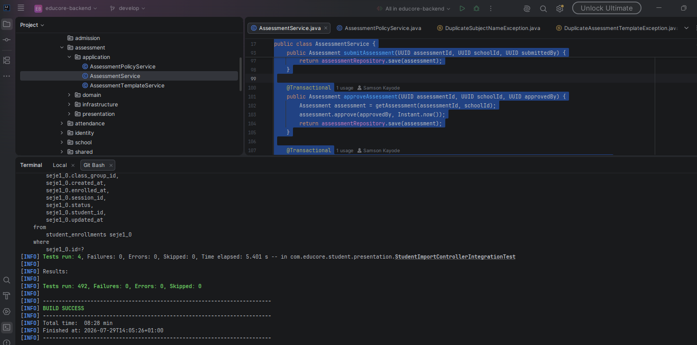
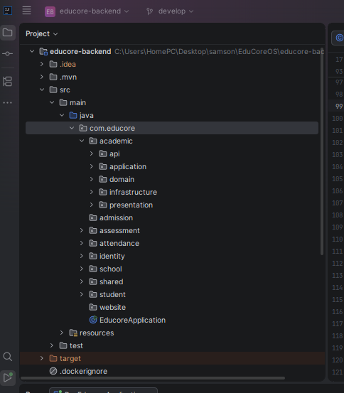

# EduCoreOS — School Operating System

> A production-minded, modular SchoolOS being built for a real Nigerian school pilot.

EduCoreOS replaces fragmented paper and spreadsheet workflows across school setup, student records, staff operations, attendance, assessment and finance with one role-aware operational system.

The production codebase is private because the project is being prepared for a real client pilot. This repository is the public engineering showcase: product scope, architecture decisions, representative domain excerpts, verification evidence, and lessons from moving a complex application toward production.

**Pilot:** Graceland International Academy (GIA), Lagos, Nigeria  
**Backend:** Java 21 · Spring Boot 3.5 · PostgreSQL 16 · Liquibase · Spring Modulith · JWT · Testcontainers  
**Frontend:** React 19 · TypeScript · Vite · TanStack Query  

---

## Why EduCoreOS Exists

Many school workflows still live across paper forms, spreadsheets, WhatsApp conversations and disconnected files. That creates duplicated work, weak auditability and operational knowledge that depends too heavily on individuals.

EduCoreOS is being designed as an operating layer for the school rather than a collection of isolated CRUD screens:

- establish the school's academic and operational foundation;
- register and manage students and staff;
- control role-based access to school workflows;
- make daily attendance traceable;
- manage assessment from policy through approval and locking;
- preserve a trustworthy financial history;
- give each role a workspace based on what the backend can actually prove.

The pilot is intentionally narrow. The goal is not to ship every possible school feature before first use; it is to make the core operational loop reliable enough for a real school to trust.

---

## Current Product Position

| Capability | Current position |
|---|---|
| Authentication, RBAC & tenant isolation | **Pilot-ready** |
| School Setup & Readiness orchestration | **Pilot-ready backend/workflow** |
| Student Management & Enrollment | **Pilot-ready** |
| Staff, Roles & Teacher Assignments | **Pilot-ready** |
| Attendance | **Pilot-ready** |
| Assessment core | **Pilot-ready** |
| Finance | **Pilot-ready** |
| Role-specific dashboards | **Pilot-ready** |
| School Calendar domain/API | **Implemented** — current UI is being re-audited against approved screens |
| Approved Screens vs Current UI audit | **In progress before external rollout** |
| Results / Report Card lifecycle | **Deliberately deferred** |
| Timetable / Scheduling | **Deliberately deferred** |
| SubjectOffering / Curriculum Mapping | **Future domain foundation** |
| Promotion, general reports, online admissions portal | **Post-pilot scope** |

> **Important:** passing tests is not treated as proof of product completeness. Before external rollout, the approved UI designs are being reconciled screen-by-screen against the current frontend routes and workflows.

---

## Verification Snapshot

The current release candidate baseline reported by the private repositories is:

- **913 / 913 backend tests passing**
- **183 / 183 frontend tests passing across 27 files**
- TypeScript project check: **PASS**
- Frontend production build: **PASS**
- Fresh-school setup: **11 readiness transitions verified through `OPERATIONALLY_READY`**
- Frontend and backend production images: **built locally and runtime-smoke-tested**
- External deployment: **not yet declared GO** — infrastructure/security/backup/monitoring gates require direct production evidence

The screenshots below are retained as earlier engineering milestones; the showcase is being refreshed with current product screenshots as the UI audit closes.



---

## What Makes the Engineering Interesting

### 1. Modular monolith with enforced boundaries

EduCoreOS uses Spring Modulith to keep bounded contexts independent while remaining operationally simple enough for an early-stage product. Cross-module reads happen through published APIs/Named Interfaces rather than repository reach-through. Module structure is verified in tests.

[Read the architecture overview →](docs/architecture.md)

### 2. Attendance models operational truth, not just rows

Attendance evolved beyond “Present/Absent”. It now includes submission lifecycle, actor/time audit, authorization by teacher context, school-calendar-aware expected days, attendance health by class and a configurable tracking-effective date for a school adopting the system mid-term.

[Read the Attendance case study →](docs/attendance.md)

### 3. Assessment is lifecycle-driven

Assessment separates configurable policy from progressive score entry. Policies remain structurally safe after use; assessments move through an explicit lifecycle and preserve moderation history instead of silently mutating finalized academic records.

[Read the Assessment case study →](docs/assessment.md)

### 4. Finance corrections preserve history

A mistaken invoice is not “deleted away” once financial activity exists. EduCoreOS models voiding, payment allocation release, credit, reallocation, reversal, refund and adjustment reasons so a correction does not destroy the financial story.

[Read the Finance case study →](docs/finance.md)

### 5. Setup is a readiness orchestrator, not a data owner

The Setup module answers whether the school can operate by composing facts from Academic, Identity, Student, Assessment and Finance through published boundaries. It does not duplicate their business data.

[Read the School Setup case study →](docs/school-setup.md)

---

## Architecture at a Glance



Current major bounded contexts include:

```text
identity
school
academic
student
attendance
assessment
finance
setup
dashboard
shared
```

Important architecture rules:

- each bounded context owns its tables and business rules;
- domain code is framework-independent;
- controllers remain thin;
- IDs cross module boundaries, not domain objects;
- factual cross-module reads use published APIs;
- cross-module reactions use events where appropriate;
- every tenant-scoped operation derives and verifies `schoolId` from authenticated context;
- module-boundary tests are part of the regression suite.

---

## Product Workflows

### School setup

A fresh school moves through a backend-authoritative readiness flow covering school foundation, academic structure, people/students, assessment policy and finance readiness. The current UI is being reconciled against the complete approved-screen inventory before rollout.

### Attendance

Class Teachers, Academic Heads and Administrators receive different authority. A subject assignment alone does not grant whole-class attendance authority. Finalized attendance drives official summaries; drafts do not.

### Assessment

Policies define weighted components; templates define reusable assessment metadata; assessments own scoring, submission, review, moderation, approval and locking.

### Finance

The finance flow covers fee structures, obligation generation, invoices, independent payments, allocations, overpayment credit, discounts/waivers, refunds, reversals, corrections and an auditable student ledger.

---

## Security & Data Integrity

Some of the non-negotiable rules in the private application:

- tenant isolation is enforced by authenticated `schoolId`;
- cross-school resource lookups do not reveal resource existence;
- protected roles cannot be granted casually through normal staff management;
- sensitive student medical information has a stricter read-permission tier;
- assessment and finance history becomes increasingly immutable as lifecycle state advances;
- audit events preserve actor UUIDs even when a human-readable identity can no longer be resolved;
- production rollout requires TLS, externalized secrets, database backup/restore evidence, monitoring and rollback ownership.

[Read more →](docs/security-and-tenancy.md)

---

## Representative Domain Code

The public repository intentionally does not contain the private product source. Instead, [`docs/domain-model.md`](docs/domain-model.md) contains small representative excerpts and pseudocode showing the patterns used to protect invariants and module boundaries without exposing client data or proprietary implementation detail.

---

## From “Tests Green” to “Product Complete”

One of the most useful lessons from this build came late in the MVP cycle.

The application had a fully green backend and frontend regression suite. Fresh-school readiness reached `OPERATIONALLY_READY`. Deployment work had started.

Then we asked a different question:

> **Have we actually implemented every user workflow represented by the approved product screens?**

That triggered a separate Approved Screens vs Current UI audit. A backend capability can exist, tests can pass, and yet a real user-facing workflow can still be missing, unreachable or incomplete.

The working definition now is:

```text
Code complete
    ↓
Integration complete
    ↓
Product complete
    ↓
Production ready
```

These are different gates.

[Read the engineering lessons →](docs/engineering-lessons.md)

---

## What Is Intentionally Not Claimed

This showcase does **not** claim that:

- the external GIA rollout is complete;
- production TLS, backups, monitoring or rollback have been proven without direct environment evidence;
- report cards are published by the current MVP;
- timetable data exists;
- every approved future screen is implemented;
- the public repository is the production source tree.

Those distinctions are deliberate. Engineering credibility is more important than an inflated feature list.

---

## Public Showcase Roadmap

This repository will continue to be updated with:

- current, sanitized product screenshots after the screen-alignment audit;
- architecture diagrams that reflect the current bounded contexts;
- additional write-ups on Finance, setup/readiness and deployment engineering;
- selected engineering lessons and incident-style bug analyses;
- release checkpoints as the pilot progresses.

See [`CHANGELOG.md`](CHANGELOG.md) for showcase updates.

---

## Repository Guide

```text
.
├── README.md
├── CHANGELOG.md
├── assets/
│   ├── architecture/
│   └── screenshots/
└── docs/
    ├── architecture.md
    ├── assessment.md
    ├── attendance.md
    ├── domain-model.md
    ├── engineering-lessons.md
    ├── finance.md
    ├── module-structure.md
    ├── school-setup.md
    └── security-and-tenancy.md
```

---

## About This Repository

EduCoreOS is an active private product project. This repository is intentionally a **case study and proof-of-work showcase**, not a source-code mirror.

No student, guardian, staff financial, credential or client-sensitive production data is published here.
