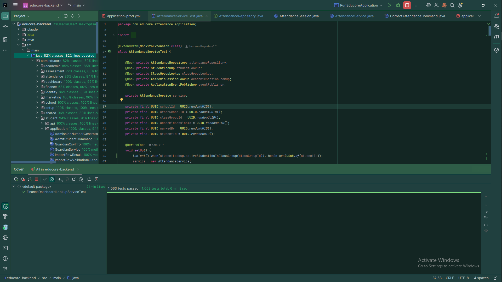
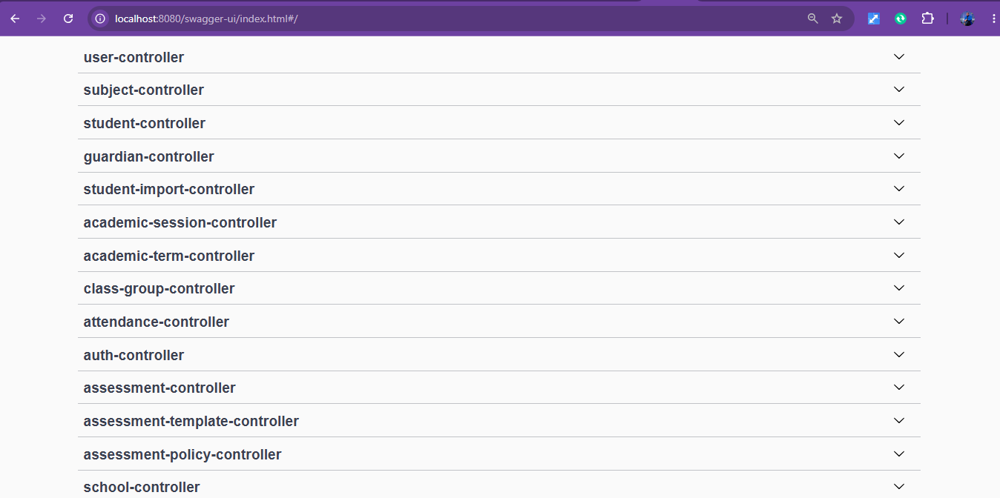

# EduCore SchoolOS — Architecture Showcase

Multi-tenant school management SaaS, built for a live pilot at Graceland 
International Academy (GIA). This repo documents architecture and design 
decisions — the working codebase is private due to the active client pilot.

## Problem
GIA, like most Nigerian schools, ran admissions, attendance, and grading 
through spreadsheets and paper — no single system, no audit trail, teachers 
compiling term reports manually in Excel.

## What's Built
Academic structure, student records and enrollment, digital attendance, and a 
configurable assessment/grading engine — all school-scope isolated for 
multi-tenancy from day one.

## Design Highlights
- [Attendance](docs/attendance.md) — the reference aggregate pattern used 
  across every module
- [Assessment](docs/assessment.md) — a grading engine modeled from a real 
  school's actual scoring components, not an assumed universal standard
- [Module Structure](docs/module-structure.md) — enforced architectural 
  boundaries via Spring Modulith

## Proof of Work

*492+ tests passing across Tier 1 (domain), Tier 2 (Mockito), and Tier 3 
(Testcontainers) suites.*

*REST API surface across all bounded contexts.*

## Stack
Java 21 · Spring Boot 3.5 · PostgreSQL 16 · Liquibase · Spring Modulith · JWT
